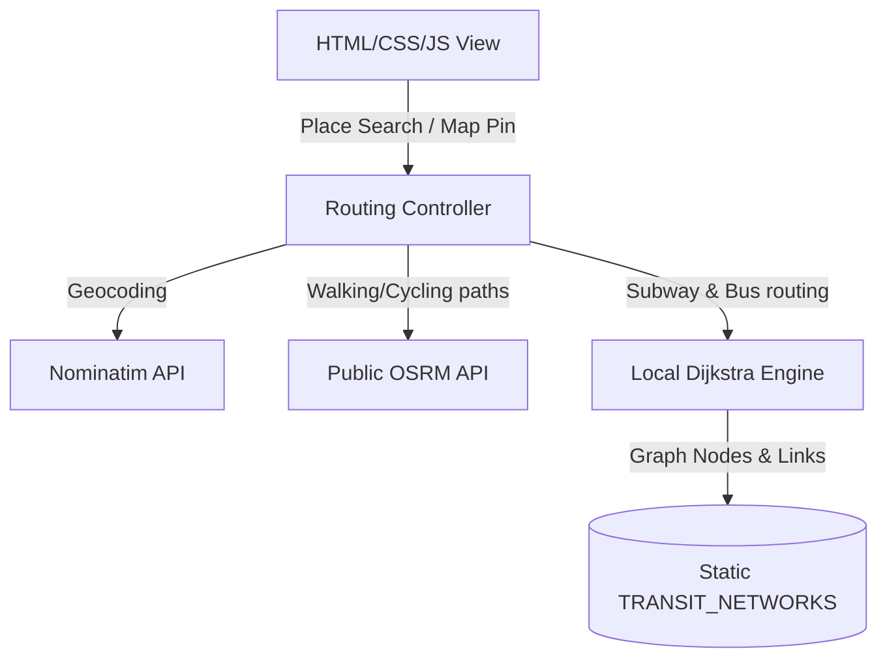

# Design Document: Transit Optimizer with Map Integration

## 1. Overview
The **Transit Optimizer** is a 100% free, offline-first hybrid transit, walking, and cycling routing engine. It integrates an interactive Leaflet map using OpenStreetMap (OSM) tiles and geocodes locations via the Nominatim API. It simulates subway and bus routes using a static local database tailored to the user's specific travel dates (Japan: June 10–19, 2026; Malaysia: June 21–July 1, 2026), accounting for weekday/weekend schedule frequencies.

---

## 2. System Architecture



### Component Details
1.  **Leaflet Map (`scheduler.html` / `scheduler.js`):**
    *   Renders OSM street tiles (fully free).
    *   Places markers for start point, end point, and intermediate transit stations.
    *   Draws OSRM coordinates for walking/cycling paths (blue/green lines) and SVG overlays for transit line routes (using colors defined in `TRANSIT_NETWORKS`).
2.  **Nominatim Geocoder:**
    *   Converts user-entered text (e.g., "Umeda Station" or "KLCC") to coordinates `[lat, lon]`.
3.  **Local Dijkstra Router (`findDijkstraRoute`):**
    *   Finds the nearest subway stations or bus stops to the start/end coordinates.
    *   Calculates the transit path between these station nodes.
    *   Determines transit travel time, waits (based on weekday/weekend intervals), transfers, and fares.
4.  **OSRM Route Engine:**
    *   Calculates exact walking paths and times from the start coordinate to the first station, and from the last station to the end coordinate.

---

## 3. Data Schema & Models

### Transit Network Schema
Each network (Japan, Malaysia) will have `nodes` with coordinates and `links` supporting weekday/weekend schedules.

```json
{
  "nodes": {
    "Nagoya Station": { "lat": 35.17091, "lon": 136.88153 },
    "Sakae": { "lat": 35.16979, "lon": 136.90827 }
  },
  "links": [
    {
      "u": "Nagoya Station",
      "v": "Sakae",
      "type": "subway",
      "line": "Higashiyama Line",
      "color": "#e53e3e",
      "fare": 210,
      "time": 5,
      "schedule": {
        "weekday": { "interval_minutes": 5, "start_hour": 5, "end_hour": 24 },
        "weekend": { "interval_minutes": 8, "start_hour": 5, "end_hour": 23 }
      }
    }
  ]
}
```

---

## 4. Route Comparison Algorithm
When a route is calculated, the system evaluates three profiles:
1.  **Fastest Route:** Compares total travel time (Walking Leg 1 + Waiting/Interval + Transit Ride + Access Leg 2) vs. pure walking vs. pure cycling.
2.  **Cheapest Route:** If the total distance is small enough for pure walking/cycling (e.g., < 3km), cost is $0. Otherwise, returns the transit route with the lowest cumulative fare.
3.  **Optimized Route:** A hybrid score that penalizes transfers and long walks:
    $$\text{Score} = \text{Duration (mins)} + (15 \times \text{Transfers}) + (2 \times \text{Walk Distance (km)})$$
    The option with the lowest score is presented as "Optimized".

---

## 5. UI/UX Features
*   **Split Panels:** Map display on the left (or top on mobile), controls and results timeline on the right.
*   **Date Selector:** Uses the trip date to dynamically read the schedule type (weekday vs. weekend) for time and interval calculations.
*   **Result Cards:** Toggleable cards for "Fastest", "Cheapest", and "Optimized" paths.
