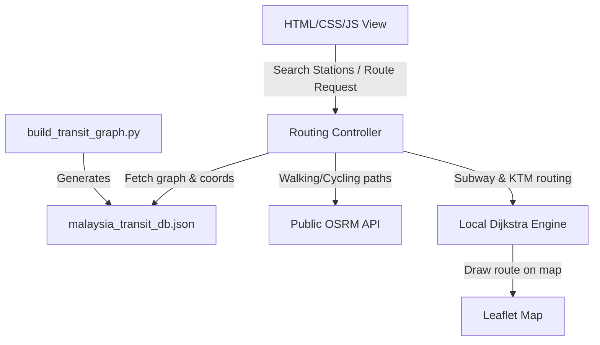

# Design Document: GTFS-Driven Transit Optimizer with Map Integration

This document outlines the design for the fully complete, schedule-aware Transit Optimizer. It replaces the basic Dijkstra router with a high-fidelity system populated by raw GTFS data from Malaysia (`rapid_rail.zip` and `ktm_komuter.zip`), mapping real coordinates, line colors, schedule intervals, and walking/cycling routes.

---

## 1. System Architecture

### Component Details
1. **Pre-processing Script (`build_transit_graph.py`):**
   - Parses GTFS feeds from Malaysia zips to compile stops, routes, stop sequences, and weekly repeating schedule patterns (Weekday vs. Weekend).
   - Generates `malaysia_transit_db.json` containing nodes and links.
2. **Dijkstra Routing Engine (`findDijkstraRoute`):**
   - Implements schedule-aware edge weighting.
   - Computes wait time based on the active day of the trip (weekday vs. weekend) and transfer penalty increments.
3. **Leaflet Map Container:**
   - Plots start, end, and intermediate station markers.
   - Draws OSRM walking lines and colored SVG transit line paths.

---

## 2. Schedule Pattern & Normalization Algorithm
- GTFS `calendar.txt` weekly binary bitmasks (e.g. `[1, 1, 1, 1, 1, 0, 0]` for Mon-Fri) are parsed to flag links as `weekday` vs `weekend`.
- Average intervals (frequencies) are computed from `frequencies.txt` or the difference density of trips in `stop_times.txt`.
- When calculating routing, the Dijkstra engine maps the user's travel date to a day of the week, reading the correct interval to add as a station waiting-time offset.

---

## 3. UI/UX Features
- **Rebuilt Optimizer Tab:** Integrated Leaflet Map container occupying the layout space, with a sidebar for Start/End station inputs, criteria selectors, and route choice cards.
- **Dynamic Quick Badges:** Clicking a highlighted station plots it as start/end directly.
